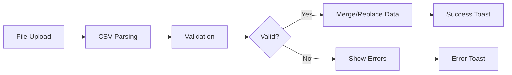

# micro-invest - Technical Structure

> Developer onboarding guide for the micro-invest portfolio tracker

## 🏗️ Architecture Overview

### Technology Stack
- **Frontend**: React 18 + TypeScript
- **Build Tool**: Vite 4.4.5
- **Styling**: Tailwind CSS 3.3.3
- **State Management**: React Context API (migrated from Zustand)
- **Charts**: Recharts 2.8.0
- **Data Processing**: PapaParse 5.5.3
- **Financial Calculations**: decimal.js 10.6.0
- **Date Handling**: date-fns 2.30.0
- **UI Components**: Radix UI, Lucide React
- **Storage**: localStorage with migration support

### Core Design Principles
- **Minimalism**: Clean, readable, lightweight code
- **Modularity**: Well-separated concerns and reusable components
- **Type Safety**: Comprehensive TypeScript usage
- **Performance**: Optimized calculations and rendering
- **Accessibility**: Semantic HTML and keyboard navigation

## 📁 File Structure

```
micro-invest/
├── public/
│   └── investments.csv          # Sample data file
├── src/
│   ├── components/
│   │   ├── layout/             # Layout components
│   │   │   ├── Card.tsx        # Reusable card wrapper
│   │   │   ├── Container.tsx   # Page container
│   │   │   └── Navigation.tsx  # Main navigation with theme toggle
│   │   ├── ui/                 # UI components
│   │   │   ├── DataControls.tsx    # Export/import controls with dropdown
│   │   │   ├── ImportDialog.tsx    # CSV import modal dialog
│   │   │   └── ViewToggle.tsx      # Toggle switch component
│   │   └── views/              # Page components
│   │       ├── AddEntry.tsx    # Data entry form
│   │       ├── Overview.tsx    # Dashboard view
│   │       ├── Snapshot.tsx    # Detailed portfolio view
│   │       └── TimeSeries.tsx  # Charts view
│   ├── context/
│   │   └── AppProvider.tsx     # Global state management
│   ├── hooks/                  # Custom React hooks
│   │   ├── useDataImport.ts    # CSV import logic
│   │   └── useToast.ts         # Toast notification system
│   ├── types/
│   │   └── index.ts           # TypeScript type definitions
│   ├── utils/
│   │   ├── calculations.ts    # Financial calculations
│   │   ├── chartData.ts       # Chart data transformations
│   │   ├── colors.ts          # Color utilities
│   │   ├── csv.ts             # CSV parsing utilities
│   │   └── storage.ts         # LocalStorage management
│   ├── App.tsx                # Main app component
│   ├── main.tsx               # React entry point
│   ├── index.css              # Global styles
│   └── vite-env.d.ts          # Vite type definitions
└── Configuration files...
```

## 🔧 Key Patterns and Conventions

### Component Structure
```typescript
// Standard component pattern
import { ComponentProps } from 'react'
import { useAppData } from '../context/AppProvider'

interface ComponentProps {
  required: string
  optional?: boolean
}

export default function Component({ required, optional }: ComponentProps) {
  const { data, updateData } = useAppData()
  
  // Component logic
  
  return (
    <div className="tailwind-classes">
      {/* Component JSX */}
    </div>
  )
}
```

### State Management Pattern
```typescript
// Context-based state management
const { data, updateData, updateUI } = useAppData()

// Update entire data structure
updateData({ entries: newEntries })

// Update UI state only
updateUI({ viewMode: 'overview' })

// Add/update/delete specific entries
addEntry(newEntry)
updateEntry(oldEntry, newEntry)
deleteEntry(date, investment)
```

### Utility Function Pattern
```typescript
// Financial calculations with decimal.js
export const calculateValue = (principal: number, rate: number): number => {
  const p = new Decimal(principal)
  const r = new Decimal(rate).div(100)
  return p.mul(r.plus(1)).toNumber()
}

// Format functions
export const formatCurrency = (amount: number): string => {
  return new Intl.NumberFormat('en-US', {
    style: 'currency',
    currency: 'USD'
  }).format(amount)
}
```

## 🗂️ Core Data Flow

### Data Types
```typescript
interface InvestmentEntry {
  date: string        // ISO date (YYYY-MM-DD)
  investment: string  // Asset name
  amount: number      // Dollar amount (negative for debt)
  rate: number        // Growth rate percentage
}

interface PortfolioSnapshot {
  date: string
  entries: InvestmentEntry[]
  totalValue: number
  totalDebt: number
  netWorth: number
}
```

### State Structure
```typescript
interface AppData {
  entries: InvestmentEntry[]
  ui: {
    selectedDate: string | null
    viewMode: 'overview' | 'snapshot' | 'timeseries' | 'add'
    theme: 'dark' | 'light'
    chartSettings: ChartSettings
    formData: FormData
  }
}

interface ChartSettings {
  mainView: 'performance' | 'ownership'
  performanceView: 'cumulative' | 'period'
  ownershipView: 'allocation' | 'value'
  showByAsset: boolean
  displayMode: 'percentage' | 'absolute'
  visibleAssets: string[]
}
```

### Data Processing Pipeline
1. **CSV Import** → `useDataImport.ts` + `csv.ts` → Parsed entries
2. **Validation** → `csv.ts` → Validated data with error reporting
3. **Snapshots** → `AppProvider.tsx` → Computed snapshots
4. **Metrics** → `calculations.ts` → Financial metrics
5. **Charts** → `chartData.ts` → Chart-ready data
6. **Storage** → `storage.ts` → LocalStorage persistence
7. **Notifications** → `useToast.ts` → User feedback

## 🧩 Component Architecture

### View Components (`src/components/views/`)
- **Overview.tsx**: Dashboard with key metrics
- **Snapshot.tsx**: Detailed portfolio view with editing
- **TimeSeries.tsx**: Interactive charts and analysis
- **AddEntry.tsx**: Data entry form

### Layout Components (`src/components/layout/`)
- **Container.tsx**: Page wrapper with responsive design
- **Navigation.tsx**: Tab navigation with keyboard shortcuts
- **Card.tsx**: Reusable card component

### Utility Components (`src/components/ui/`)
- **DataControls.tsx**: Export/import dropdown with toast notifications
- **ImportDialog.tsx**: Modal dialog for CSV file import with validation
- **ViewToggle.tsx**: Toggle switch for chart options

### Custom Hooks (`src/hooks/`)
- **useDataImport.ts**: CSV import logic with error handling
- **useToast.ts**: Toast notification system with auto-dismiss

## 🧮 Financial Calculations

### Key Calculation Functions
Located in `src/utils/calculations.ts`:

```typescript
// Core calculations
calculateCompoundGrowth(principal, rate, periods)
calculateAssetPerformance(entries, assetName)
calculatePortfolioMetrics(snapshots)
calculateSnapshot(entries, date)

// Formatting
formatCurrency(amount, compact?)
formatPercentage(percentage, decimals?)
formatGrowth(growth)

// Analysis
calculateRiskLevel(volatility)
getDiversificationScore(allocation)
calculateAllocation(snapshot)
```

### Precision Handling
```typescript
// Using decimal.js for financial precision
Decimal.set({ precision: 28, rounding: 4 })

const calculateValue = (amount: number, rate: number): number => {
  const a = new Decimal(amount)
  const r = new Decimal(rate).div(100)
  return a.mul(r.plus(1)).toNumber()
}
```

## 📊 Chart System

### Chart Data Transformation
Located in `src/utils/chartData.ts`:

```typescript
// Transform snapshots for different chart types
export const transformSnapshots = (
  snapshots: PortfolioSnapshot[],
  dataType: 'returns' | 'portfolio' | 'allocation',
  viewType: 'cumulative' | 'period'
): ChartDataPoint[]
```

### Color Management
Located in `src/utils/colors.ts`:
- Consistent color mapping for assets
- Support for light/dark themes
- Accessibility-friendly color choices

## 🎯 User Experience Features

### Theme System
- **Dark/Light Mode**: Toggle via Navigation UI or keyboard shortcut
- **Persistent Storage**: Theme preference saved in localStorage
- **CSS Variables**: Consistent theming across components
- **Keyboard Shortcut**: `t` key for quick theme switching

### Toast Notifications
Located in `src/hooks/useToast.ts`:

```typescript
interface Toast {
  id: string
  message: string
  type: 'success' | 'error'
}

export const useToast = () => {
  const { toasts, toast, dismiss } = useToast()

  // Usage
  toast('Export successful!', 'success')
  toast('Import failed', 'error')
}
```

**Features**:
- Auto-dismiss after 3 seconds
- Manual dismiss with close button
- Success/error styling
- Multiple toast support

### CSV Import/Export System

#### Import Flow


#### Export Features
- **Automatic Filename**: `micro-invest-YYYY-MM-DD.csv`
- **Complete Data**: All entries with proper formatting
- **Error Handling**: Toast notifications for success/failure

### Keyboard Shortcuts
- **`1`**: Overview view
- **`2`**: Snapshot view
- **`3`**: TimeSeries view
- **`4`**: Add Entry view
- **`t`**: Toggle theme
- **Smart Detection**: Disabled when typing in input fields

## 💾 Storage System

### LocalStorage Management
Located in `src/utils/storage.ts`:

```typescript
export const AppStorage = {
  load(): AppData           // Load from localStorage
  save(data): void         // Save to localStorage
  update(updater): void    // Update with function
  clear(): void            // Clear all data
  migrateFromZustand(): void  // Migrate from old format
}
```

### Migration Strategy
- Automatic detection of old Zustand storage
- Seamless migration to new format
- Backward compatibility maintained

## 🔄 Development Workflow

### Getting Started
```bash
# Install dependencies
npm install

# Start development server
npm run dev

# Build for production
npm run build

# Preview production build
npm run preview

# Lint code
npm run lint
```

### Adding New Features

#### 1. New View Component
```typescript
// src/components/views/NewView.tsx
import { useAppData } from '../../context/AppProvider'

export default function NewView() {
  const { data, updateUI } = useAppData()

  return (
    <div className="space-y-6">
      {/* Your component */}
    </div>
  )
}
```

#### 2. Update Navigation
```typescript
// src/components/layout/Navigation.tsx
const tabs = [
  // existing tabs...
  { id: 'newview' as ViewMode, label: 'New View', key: '5' }
]
```

#### 3. Add Route in App.tsx
```typescript
// src/App.tsx
const renderView = () => {
  switch (viewMode) {
    // existing cases...
    case 'newview':
      return <NewView />
  }
}
```

#### 4. Update Types
```typescript
// src/types/index.ts
export type ViewMode = 'overview' | 'snapshot' | 'timeseries' | 'add' | 'newview'
```

### Adding UI Components with Notifications

#### With Toast Notifications
```typescript
// Component with toast feedback
import { useToast } from '../../hooks/useToast'

export default function ComponentWithFeedback() {
  const { toast } = useToast()

  const handleAction = async () => {
    try {
      await performAction()
      toast('Action completed successfully!', 'success')
    } catch (error) {
      toast('Action failed. Please try again.', 'error')
    }
  }

  return (
    <button onClick={handleAction}>
      Perform Action
    </button>
  )
}
```

#### With Data Import
```typescript
// Component that imports data
import { useDataImport } from '../../hooks/useDataImport'

export default function DataImporter() {
  const { importCSV } = useDataImport()

  const handleFileImport = async (file: File) => {
    const result = await importCSV(file, 'merge')
    if (result.success) {
      console.log(`Imported ${result.count} entries`)
    } else {
      console.error('Import failed:', result.errors)
    }
  }

  return (
    <input
      type="file"
      accept=".csv"
      onChange={(e) => {
        const file = e.target.files?.[0]
        if (file) handleFileImport(file)
      }}
    />
  )
}
```

### Adding New Calculations
```typescript
// src/utils/calculations.ts
export const calculateNewMetric = (
  snapshots: PortfolioSnapshot[]
): number => {
  // Use Decimal.js for precision
  // Return calculated value
}
```

### Adding New Chart Types
```typescript
// src/utils/chartData.ts
export const transformForNewChart = (
  snapshots: PortfolioSnapshot[]
): ChartDataPoint[] => {
  // Transform data for new chart type
}
```

## 🎨 Styling Guidelines

### Tailwind Usage
```typescript
// Use semantic class names
<div className="bg-background text-text-primary">
  <h1 className="text-xl font-semibold">Title</h1>
  <p className="text-text-secondary">Description</p>
</div>
```

### Custom CSS Variables
```css
/* src/index.css */
:root {
  --color-background: #ffffff;
  --color-text-primary: #1f2937;
  --color-accent: #3b82f6;
  /* ... */
}
```

### Responsive Design
```typescript
// Mobile-first approach
<div className="grid grid-cols-1 md:grid-cols-2 lg:grid-cols-3">
  {/* Responsive grid */}
</div>
```

## 🧪 Testing Strategy

### Component Testing
```typescript
// Future: Add React Testing Library
import { render, screen } from '@testing-library/react'
import { AppProvider } from '../context/AppProvider'

const renderWithProvider = (component: React.ReactElement) => {
  return render(
    <AppProvider>
      {component}
    </AppProvider>
  )
}
```

### Calculation Testing
```typescript
// Future: Add Jest for utility testing
import { calculateCompoundGrowth } from '../utils/calculations'

test('calculates compound growth correctly', () => {
  expect(calculateCompoundGrowth(1000, 5, 12)).toBeCloseTo(1795.85)
})
```

## ⚡ Performance Considerations

### Optimization Strategies
1. **Memoization**: Use `useMemo` for expensive calculations
2. **Component Splitting**: Lazy load heavy components
3. **Data Pagination**: Handle large datasets efficiently
4. **Debouncing**: Debounce user inputs
5. **Virtual Scrolling**: For large lists (future)

### Memory Management
```typescript
// Cleanup effects
useEffect(() => {
  const handler = (event: KeyboardEvent) => {
    // Handle keyboard shortcuts
  }
  
  window.addEventListener('keydown', handler)
  return () => window.removeEventListener('keydown', handler)
}, [])
```

## 🔍 Debugging Guide

### Common Issues
1. **State not updating**: Check Context Provider wrapping
2. **Calculations incorrect**: Verify decimal.js usage
3. **Charts not rendering**: Check data format and Recharts props
4. **Storage issues**: Clear localStorage and restart

### Development Tools
- React DevTools for component inspection
- Browser DevTools for network and performance
- TypeScript compiler for type checking
- ESLint for code quality

## 🚀 Deployment

### Build Process
```bash
# Production build
npm run build

# Outputs to dist/ directory
# Static files ready for deployment
```

### Environment Configuration
```typescript
// vite.config.ts
export default defineConfig({
  plugins: [react()],
  build: {
    outDir: 'dist',
    sourcemap: true
  }
})
```

## 📋 Contributing Guidelines

### Code Style
- Use TypeScript for all new code
- Follow existing naming conventions
- Add JSDoc comments for complex functions
- Use "##" for comments, "#" for commenting out code
- Avoid try-catch blocks except for minor processing failures

### Function Organization
- **Data processing**: `src/utils/data_utils.ts`
- **Formatting**: `src/utils/format_utils.ts`
- **Calculations**: `src/utils/calculations.ts`
- **Chart utilities**: `src/utils/chartData.ts`

### Pull Request Process
1. Create feature branch from `main`
2. Implement changes following existing patterns
3. Test thoroughly across all views
4. Update STRUCTURE.md if adding new patterns
5. Submit PR with clear description

## 🔄 Migration Notes

### From Zustand to Context API ✅
- **Completed**: Full state management migration
- **Storage**: Automatic migration from `investment-storage` to `micro-invest-data`
- **API**: `useAppData` hook provides complete state access
- **Features Added**: Theme system, enhanced UI state management

### Current Architecture Benefits
- **Lightweight**: No external state management dependencies
- **Type Safe**: Full TypeScript integration
- **Persistent**: LocalStorage with migration support
- **Modular**: Clean separation of concerns

---

## 📚 Learning Resources

### Key Concepts to Understand
1. **React Context API**: Global state management with hooks
2. **Custom Hooks**: `useToast`, `useDataImport` for reusable logic
3. **decimal.js**: Precise financial calculations
4. **CSV Processing**: PapaParse with validation
5. **Theme System**: CSS variables with localStorage persistence
6. **Recharts**: Chart library with responsive design
7. **Tailwind CSS**: Utility-first styling with custom CSS variables
8. **TypeScript**: Comprehensive type safety

### Recommended Reading
- [React Context API Best Practices](https://react.dev/learn/passing-data-deeply-with-context)
- [Custom Hooks Guide](https://react.dev/learn/reusing-logic-with-custom-hooks)
- [Financial Calculations in JavaScript](https://github.com/MikeMcl/decimal.js/)
- [PapaParse CSV Library](https://www.papaparse.com/)
- [Recharts Documentation](https://recharts.org/)
- [Tailwind CSS Documentation](https://tailwindcss.com/docs)

### Architecture Summary
This micro-invest app follows a **minimalist, modular architecture** with:
- **No external state management** (pure React Context)
- **Custom hooks** for cross-cutting concerns
- **Comprehensive TypeScript** for type safety
- **LocalStorage persistence** with migration support
- **Toast notifications** for user feedback
- **CSV import/export** with validation
- **Dark/light theming** with persistence
- **Keyboard shortcuts** for power users

The codebase prioritizes **clean, readable code** over corporate complexity, making it maintainable by lean teams while providing a robust financial tracking experience. 